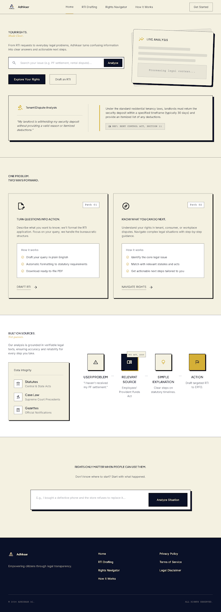
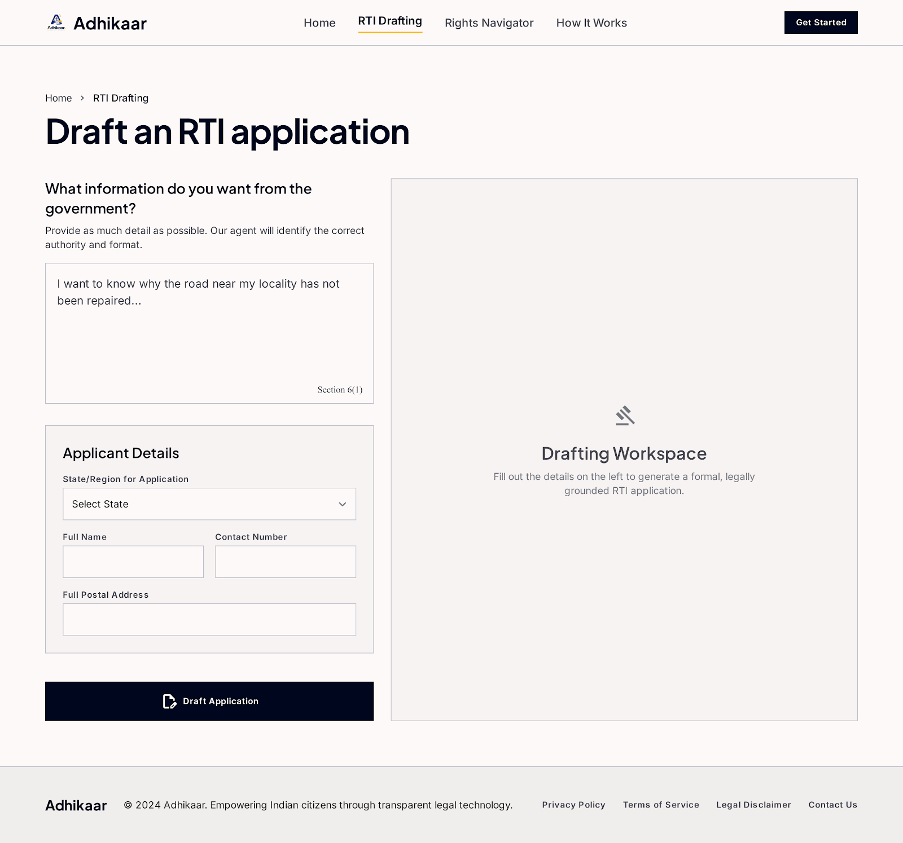
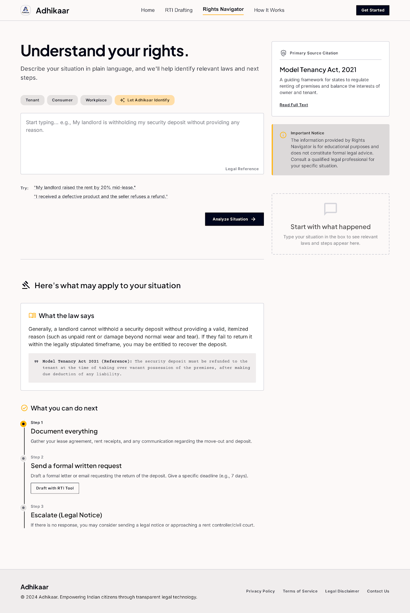
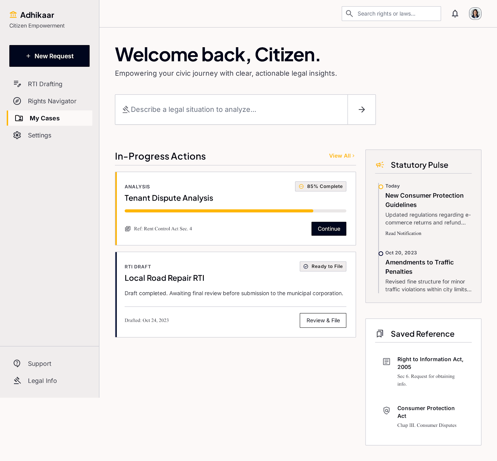

<div align="center">


# Adhikaar AI
### अधिकार — *Your Right, Understood.*

**AI for Civic and Legal Empowerment**

**KNOW • ACT • EMPOWER**

[](#)
[](#)
[](#)
[](#)
[](#)
[](#)

**[🚀 Live Demo](https://adhikaar-gamma.vercel.app)** &nbsp;·&nbsp; **[📂 Repository](https://github.com/Ankitjha9990/Adhikaar)** &nbsp;·&nbsp; **[🎬 Demo Video](#)**

</div>

---

## 📖 Table of Contents

- [The Problem](#-the-problem)
- [Our Solution](#-our-solution)
- [What Makes Adhikaar Different](#-what-makes-adhikaar-different)
- [Adhikaar vs. Asking ChatGPT / Claude Directly](#-adhikaar-vs-asking-chatgpt--claude-directly)
- [Core Features](#-core-features)
- [Screenshots](#-screenshots)
- [Technical Architecture](#-technical-architecture)
- [Tech Stack](#-tech-stack)
- [Repository Structure](#-repository-structure)
- [Getting Started](#-getting-started)
- [Environment Variables Reference](#-environment-variables-reference)
- [Sample Queries to Try](#-sample-queries-to-try)
- [Known Limitations](#-known-limitations)
- [Roadmap — What's Next](#-roadmap--whats-next)
- [Disclaimer](#-disclaimer)
- [Team & Acknowledgements](#-team--acknowledgements)

---

## 🧩 The Problem

India's citizens are entitled to powerful legal protections — the **Right to Information**, **tenant rights**, **consumer rights**, and **workplace rights** — yet most of these rights exist only on paper. They go unused not because they don't exist, but because:

- ⚖️ **Legal language is dense and intimidating.** Acts and government notices are written for lawyers and bureaucrats, not for the citizen trying to use them.
- 🧭 **Information is scattered.** Relevant provisions are buried across PDFs, gazettes, and portals that were never designed to answer *one person's specific* problem.
- ❓ **Even an aware citizen gets stuck on three questions:** *Which law applies to me? Which authority do I approach? How do I phrase a formal request correctly?*
- 📝 **The drafting friction is real.** Formatting a correctly addressed RTI application, or understanding the exact steps in a tenant/consumer/workplace dispute, causes most people to simply give up before they start.

The result is a wide, persistent gap between **"rights that exist on paper"** and **"rights that are actually exercised."**

---

## 💡 Our Solution

**Adhikaar AI** is a focused, two-feature web application that converts a citizen's plain-language problem into concrete, actionable legal help — grounded strictly in real statutory text via **Retrieval-Augmented Generation (RAG)**, not open-ended LLM guesswork.

### 1️⃣ RTI Drafting Agent
Turns a plain-language grievance — *"I want to know why my road hasn't been repaired in 6 months"* — into a **submission-ready RTI application**, correctly addressed to the right Public Information Officer / department, citing the exact RTI Act provisions, and downloadable as a formatted **PDF**.

### 2️⃣ Rights Navigator
Takes a plain-language dispute — *"my landlord is refusing to return my security deposit"* — auto-classifies it (tenant / consumer / workplace / harassment), retrieves the governing law, and returns a **plain-language explanation**, **numbered next steps**, and **traceable citations** to the exact act and section.

Both features share one non-negotiable design principle: **every claim must be traceable to a real, retrieved statutory source.** If the retrieved context doesn't support an answer, the system is instructed to say so rather than invent a citation.

---

## 🏆 What Makes Adhikaar Different

| Pillar | How Adhikaar Delivers It |
|---|---|
| **Grounded, not guessed** | Every generation call is grounded in a FAISS vector store built from hand-curated Indian legal source documents — not the model's parametric memory. |
| **Legal validity awareness** | Each source chunk is tagged with a validity status (*Current* / *Repealed*). The Rights Navigator is explicitly instructed to cite the current in-force law (e.g. Code on Wages, 2019) instead of a repealed one (e.g. Payment of Wages Act, 1936), even if the repealed act shows up in retrieval. |
| **Structured, actionable output** | Responses aren't a wall of text — they're a formatted RTI letter with a PDF export, or a numbered action plan (preserve evidence → written notice → statutory authority → free legal aid), not just an explanation. |
| **Correct-authority routing** | A department lookup table + LLM reasoning together route RTI queries to the *legally correct* Public Authority (e.g. Central subjects → CPIO, PMO; local subjects → Municipal/State PIO) instead of guessing. |
| **Transparent scope** | The system never pretends to cover all of Indian law. Statute coverage and dataset scope are documented openly (see [Known Limitations](#-known-limitations)) rather than hidden behind confident-sounding answers. |
| **Built for the "so what next" moment** | The product doesn't stop at *"here's what the law says."* It ends at *"here's exactly what to do about it,"* including free legal aid routes like DLSA and the National Legal Aid Helpline (15100). |

---

## 🆚 Adhikaar vs. Asking ChatGPT / Claude Directly

A reasonable question: *"Why not just ask an LLM chatbot the same thing?"* Here's the honest comparison.

| | **General-purpose LLM chat (ChatGPT / Claude, etc.)** | **Adhikaar AI** |
|---|---|---|
| **Source of truth** | Parametric knowledge — the model's training data, which may be outdated, incomplete, or subtly wrong for Indian statutes | Retrieval-Augmented Generation over a curated, versioned corpus of actual Indian legal source text |
| **Citations** | Often plausible-sounding but **unverifiable**, and can hallucinate a section number that doesn't exist | Citations are constrained to sections **explicitly present** in the retrieved context; the prompt forbids inventing acts, sections, or fees |
| **Repealed vs. current law** | No inherent mechanism to know an act was repealed and replaced (e.g. Payment of Wages Act, 1936 → Code on Wages, 2019) | Every source chunk carries a `LEGAL VALIDITY STATUS`, and the model is explicitly instructed to cite the current replacement law |
| **Output format** | Free-form prose you must reformat yourself into a "real" application | A **submission-ready RTI application** in the correct legal letter format, addressed to the correct authority, exportable as a PDF |
| **Authority routing** | You have to already know which department/PIO to address — the chatbot can't reliably tell you | A department-lookup table + reasoning layer maps your grievance to the correct Public Authority automatically |
| **Actionability** | Usually ends at an explanation | Ends at a **numbered, sequenced action plan** — evidence, written notice, filing authority, free legal aid — tailored to the dispute category |
| **Consistency across sessions** | Answers can vary in structure and completeness from prompt to prompt | A fixed generation schema (JSON) guarantees every response has the same reliable shape: explanation + steps + citations, or application + department + citations |
| **Purpose-built UX** | A blank chat box — no dedicated dashboard, application history, or one-click PDF | A dedicated flow: landing page → guided input form → structured result → dashboard with history and citation counts |

**In short:** a general chatbot answers *"what does the law generally say?"*. Adhikaar AI answers *"what does the law say about my exact situation, who do I send this to, and what's the document I need — right now, verified against real source text."*

---

## ✨ Core Features

- 📝 **RTI Drafting Agent** — plain language → correctly formatted, citation-backed RTI application → downloadable PDF
- 🧭 **Rights Navigator** — plain language dispute → auto-classified domain (tenant / consumer / workplace / harassment) → grounded explanation + numbered next steps
- 🔎 **Retrieval-Augmented Generation** — every answer is grounded in pre-indexed legal source documents via a FAISS vector index, not free-form LLM output
- ⏳ **Legal validity engine** — distinguishes *Current* law from *Repealed* law and always steers citizens toward the currently enforceable statute
- 🏛️ **Smart authority routing** — maps grievances to the correct Public Information Officer / department using a curated department-lookup table
- 📄 **One-click PDF export** — RTI applications are rendered into a clean, submission-ready PDF using ReportLab
- 🔐 **Lightweight authentication** — JWT-based auth with a resilient in-memory fallback store if MongoDB is unreachable, so the demo never hard-fails
- 📊 **Personal dashboard** — tracks RTI applications drafted, rights queries resolved, and total citations retrieved
- 🚦 **Graceful degradation** — if the department database is empty or the AI microservice times out, the app fails safely with clear error messaging instead of crashing
- ⚠️ **Built-in disclaimers** — every output is clearly labelled as a drafting/educational aid, not legal advice

---

## 🖼️ Screenshots

<div align="center">

| Landing Page | RTI Drafting Agent |
|:---:|:---:|
|  |  |

| Rights Navigator | Dashboard |
|:---:|:---:|
|  |  |

</div>

---

## 🏗️ Technical Architecture

```
┌─────────────────────────┐
│      React + Vite        │   Landing page · RTI flow · Rights Navigator flow
│        (client/)         │   Auth · Dashboard · PDF download
└────────────┬─────────────┘
             │  REST (Axios) — VITE_API_URL
             ▼
┌─────────────────────────┐
│   Express API (Node.js)  │   Auth (JWT) · Request validation · Department lookup
│        (server/)         │◄──────► MongoDB Atlas (Users, DepartmentLookup, LegalSourceMetadata)
└────────────┬─────────────┘
             │  Internal REST — X-Internal-Key header
             ▼
┌─────────────────────────┐
│  Python AI Microservice  │   FastAPI · Prompt orchestration · JSON-schema enforcement
│      (ai_service/)       │   PDF generation (ReportLab)
└────────────┬─────────────┘
             │
     ┌───────┴────────┐
     ▼                ▼
┌───────────┐   ┌──────────────────────────┐
│  FAISS     │   │  LLM APIs                 │
│  Vector    │   │  • Gemini (embeddings —   │
│  Store     │   │    gemini-embedding-001)  │
│ (in-memory)│   │  • Groq (generation —     │
└─────┬──────┘   │    openai/gpt-oss-120b)   │
      │          └──────────────────────────┘
      ▼
Pre-indexed legal source .txt files
(RTI Act · Model Tenancy Act · Consumer Protection Act ·
 Code on Wages · Hindu Marriage/Succession Acts · POCSO ·
 RERA · Legal Services Authorities Act, etc.)
```

**Request flow (Rights Navigator example):**
1. User submits a plain-language dispute description in the React client.
2. Express validates the request and forwards it to the Python microservice over an authenticated internal channel.
3. The FastAPI service classifies the dispute category (keyword-based routing for speed and demo reliability).
4. The query is embedded (Gemini) and matched against the FAISS index, filtered by category, with **current law prioritized over repealed law**.
5. The retrieved chunks are injected into a strict, schema-enforcing prompt sent to the generation model (Groq).
6. The model returns structured JSON — explanation, numbered steps, citations — which is parsed, validated, and returned up the chain to the UI.

---

## 🛠️ Tech Stack

<div align="center">

| Layer | Technology |
|---|---|
| **Frontend** | React 19 · Vite · React Router 7 · Axios |
| **Backend API** | Node.js · Express 4 · Mongoose · JWT (jsonwebtoken) · bcryptjs · Helmet |
| **Database** | MongoDB Atlas |
| **AI Microservice** | Python · FastAPI · Pydantic · Uvicorn |
| **Embeddings** | Google Gemini (`gemini-embedding-001` / `text-embedding-004`) via `google-genai` |
| **Generation (LLM)** | Groq (`openai/gpt-oss-120b`) with strict JSON-schema prompting |
| **Vector Store** | FAISS (`faiss-cpu`), in-memory, initialized at service startup |
| **PDF Generation** | ReportLab |
| **Deployment** | Frontend on Vercel · Backend & AI service on Render |

</div>

---

## 📁 Repository Structure

```
Adhikaar/
├── Design/                     # Logo, screenshots, PRD, TRD, agent rules
│   └── Project_details/
├── ai_service/                 # Python FastAPI microservice (RAG + generation)
│   ├── data/sources/           # Hand-curated legal source .txt files
│   ├── main.py                 # API routes: /internal/rti/generate, /internal/rights/analyze
│   ├── rag.py                  # Embedding, FAISS indexing, retrieval logic
│   ├── prompts.py              # Grounded generation prompts (RTI + Rights)
│   ├── pdf_generator.py        # ReportLab PDF rendering
│   └── seed/                   # Department lookup seed data
├── server/                     # Node.js + Express backend
│   ├── routes/                 # auth.js, rti.js, rights.js
│   ├── models/                 # User, DepartmentLookup, LegalSourceMetadata
│   ├── middleware/              # JWT auth, error handling
│   └── seed/                   # seedDepartments.js
└── client/                     # React + Vite frontend
    └── src/
        ├── pages/               # Landing, RTI Drafting, Rights Navigator, Dashboard, Auth
        ├── components/          # Navbar, Footer, LoginModal, DisclaimerBanner, CitationBadge
        └── context/             # AuthContext
```

---

## 🚀 Getting Started

### Prerequisites

- Node.js **v18+**
- Python **v3.10+**
- A MongoDB Atlas cluster connection string
- A Google **Gemini API key** (`GEMINI_API_KEY`)
- A **Groq API key** (`GROQ_API_KEY`, plus optional per-feature keys)

### 1. Python AI Service (`ai_service/`)

```bash
cd ai_service

# Install dependencies
pip install -r requirements.txt

# Configure environment
cp .env.example .env
```

Set in `ai_service/.env`:

```env
GEMINI_API_KEY=your_gemini_api_key_here
GROQ_API_KEY=your_groq_api_key_here
GROQ_API_KEY_RTI=your_rti_groq_api_key_here
GROQ_API_KEY_RIGHTS=your_rights_groq_api_key_here
INTERNAL_SECRET=<same-long-random-value-as-server>
```

Run it:

```bash
uvicorn main:app --host 0.0.0.0 --port 8000 --reload
```

**Deploying on Render:**
```
Root Directory:  ai_service
Build Command:   pip install -r requirements.txt
Start Command:   uvicorn main:app --host 0.0.0.0 --port $PORT
Health Check:    /health
```

### 2. Express Backend (`server/`)

```bash
cd server
npm install
cp .env.example .env
```

Set in `server/.env`:

```env
PORT=5000
MONGODB_URI=mongodb+srv://<user>:<password>@cluster.mongodb.net/adhikaar?retryWrites=true&w=majority
PYTHON_SERVICE_URL=http://localhost:8000
CORS_ORIGINS=https://your-frontend.vercel.app
INTERNAL_SECRET=<same-long-random-value-as-ai-service>
JWT_SECRET=<generate-a-different-long-random-value>
```

> ⚠️ `INTERNAL_SECRET` must be **identical** in both `server/.env` and `ai_service/.env` — it authenticates the internal Express → FastAPI channel via the `X-Internal-Key` header.

Seed the department lookup collection (run once):

```bash
node seed/seedDepartments.js
```

Start the server:

```bash
npm run dev
```

### 3. React Frontend (`client/`)

```bash
cd client
npm install
npm run dev
```

Runs on `http://localhost:5173` and proxies API calls to `http://localhost:5000/api`.

For a deployed build, set `VITE_API_URL` to your deployed **Express backend** URL (not the Python service URL).

---

## 🔑 Environment Variables Reference

| Variable | Service | Purpose |
|---|---|---|
| `GEMINI_API_KEY` | `ai_service` | Embeddings for RAG (`gemini-embedding-001`) |
| `GROQ_API_KEY` / `GROQ_API_KEY_RTI` / `GROQ_API_KEY_RIGHTS` | `ai_service` | Generation calls (Groq `openai/gpt-oss-120b`) |
| `INTERNAL_SECRET` | `ai_service` + `server` | Shared secret authenticating the internal Express ↔ FastAPI channel |
| `MONGODB_URI` | `server` | MongoDB Atlas connection string |
| `PYTHON_SERVICE_URL` | `server` | Base URL of the deployed/local AI microservice |
| `CORS_ORIGINS` | `server` | Allowed frontend origin(s), comma-separated |
| `JWT_SECRET` | `server` | Signs user auth tokens |
| `VITE_API_URL` | `client` | Base URL of the deployed/local Express backend |

---

## 🧪 Sample Queries to Try

**RTI Drafting Agent**
> *"I want to know why the road repair work near my house hasn't started in 6 months."*
> *"I need information on how PM CARES Fund donations are being utilized."*

**Rights Navigator**
> *"My landlord is refusing to return my ₹20,000 security deposit even though I've vacated the flat."*
> *"My employer deducted half my salary this month without any explanation."*
> *"I bought a phone online and it arrived defective, but the seller won't issue a refund."*

---

## ⚠️ Known Limitations

- **Dataset scope:** Department lookup is pre-seeded with a representative set of categories (road repair, ration card, water supply, electricity, birth certificate, pension, school admission, property tax) — not a nationwide directory.
- **Statute coverage:** Grounded retrieval currently covers key provisions of the RTI Act (2005), Model Tenancy Act (2021), Consumer Protection Act (2019), Code on Wages (2019), and a curated set of additional acts (Hindu Marriage/Succession Acts, POCSO, RERA, Legal Services Authorities Act, and others) — not the full body of Indian law.
- **No long-term PII persistence:** Applicant details (name, address, contact) are used transiently to generate a document for the request cycle and are not stored in the database.
- **Single-state grounding for tenant law:** India's tenant law varies by state; the prototype grounds tenant disputes in the Model Tenancy Act, 2021, and states this scope transparently rather than claiming state-specific accuracy.
- **Not a filing service:** Adhikaar does not submit RTIs to government portals or file complaints on the user's behalf — it prepares the document/guidance for the citizen to act on.
- **Legal disclaimer:** All outputs are automated drafting aids and educational tools, **not legal advice**.

---

## 🗺️ Roadmap — What's Next

- 🌐 **Hindi & regional language support** for both input and generated output
- 📚 **Expanded statute coverage** — broader RTI department directory and additional state-specific tenancy acts
- 🧾 **Scheme Eligibility Reader** — plain-language matching of citizens to government welfare schemes they qualify for
- 🗣️ **Conversational Form-Filler** — guided, multi-turn intake for complex applications instead of a single free-text box
- 📮 **RTI status tracking** — optional reminders and follow-up drafting (first appeal, second appeal) if no response is received in the statutory window
- 🔔 **Follow-up Q&A** on a generated Rights Navigator response, grounded in the same retrieved context
- 🧑‍⚖️ **Lawyer/DLSA handoff integration** — one-click routing to free legal aid services for cases beyond the app's scope
- 📈 **Admin analytics** on common grievance categories to help identify systemic civic issues
- 🔒 **Full production-grade auth & data persistence**, replacing the current in-memory fallback store

---

## 📜 Disclaimer

Adhikaar AI is a **hackathon prototype** built for the **OOSC 4.0 Hackathon** (Problem Statement 3 — *AI for Civic and Legal Empowerment*). It is an automated **drafting aid and educational tool**. It does **not** constitute legal advice, does not guarantee outcomes, and does not replace consultation with a qualified legal professional. Always verify department addresses, statutory timelines, and current law before formal submission.

---

## 🙌 Team & Acknowledgements

Built for the **OOSC 4.0 Hackathon, IIIT Allahabad** — Track: *AI for Civic and Legal Empowerment.*

<div align="center">

**Adhikaar AI — Know your rights. Act on them. Get empowered.**


</div>